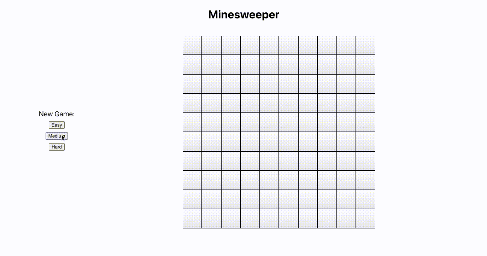
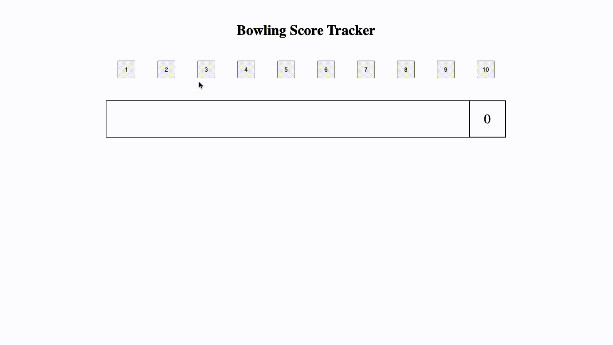

# Mini-Apps-2

A collection of game apps

## Table of Contents

1. [Minesweeper](#Minesweeper)
2. [Bowling Scoreboard](#Bowling)

## Minesweeper
React, Redux, JavaScript, CSS

From minesweeper file:
1. `npm install`
2. `npm run build`
3. Serve minesweeper at http://localhost:3000 : `npm run start`

## Bowling Scoreboard
JavaScript, React, CSS, Webpack, Babel, Node, Express

From bowling file:
1. `npm install`
2. `npm run build`
3. Serve tic-tac-toe at http://localhost:3002 : `npm run start`